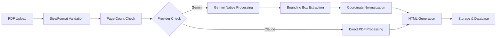

# PDF Upload Gemini Native (v3) - Architecture and Implementation Guide

## Overview

The v3 PDF upload pipeline leverages Gemini's unique native PDF processing capabilities with built-in bounding box detection. This represents a significant upgrade from the original v1 LLM pipeline, providing a middle ground between simple text extraction and complex vision-based processing.

**Key Differentiator**: Gemini is the only major LLM with native bounding box support, returning normalized coordinates (0-1000 scale) without requiring fine-tuning or image conversion.

## Architecture Overview

### Processing Flow



### Key Components

1. **API Route**: `/api/upload-pdf`
   - Handles multipart form uploads
   - Provider selection (Claude/Gemini)
   - Fail-fast validation

2. **Gemini Native Processor**: `lib/services/gemini-native-pdf-processor.ts`
   - Direct PDF-to-HTML conversion
   - Bounding box extraction and normalization
   - Token exhaustion detection

3. **Prompt Template**: `lib/prompts/templates/pdf-to-html-v3-gemini-native.njk`
   - Explicit verbatim transcription instructions
   - Bounding box format specifications (0-1000 scale)
   - Academic content preservation

## Cost Analysis

### Per-Page Processing Costs

**Gemini 2.5 Flash (Native PDF)**:
- Input: ~1,800-2,000 tokens per page (actual usage, not documented 258)
- Output: ~2,000-3,000 tokens per page
- Cost: $0.075/M input + $0.30/M output tokens
- **Total: ~$0.001 per page** (3x cheaper than Claude 4)

**Comparison with Other Pipelines**:
- v2 Vision Pipeline: ~$0.10-0.20 per page (100x more expensive)
- Claude 4 Direct: ~$0.003 per page (3x more expensive than Gemini)

### Typical Document Costs

- 20-page academic paper: ~$0.02 with Gemini Native
- 100-page document: ~$0.10 with Gemini Native
- Processing time: 20-30 seconds for typical papers

## When to Use Each Pipeline

### Use v3 Gemini Native When:
- Cost optimization is important
- Documents are under 20MB (Gemini API limit)
- Bounding box metadata is needed for future features
- Processing standard academic PDFs

### Use Claude Direct When:
- Maximum accuracy is required
- Documents are 20-32MB (Gemini limit but within Claude limit)
- User explicitly selects Claude provider

### Automatic Fallback Behavior
- **No automatic fallbacks** - fail fast philosophy
- If Gemini cannot process, return HTTP 413 with clear error
- User must explicitly choose alternative method

## Performance Characteristics

### Processing Speed
- **Initialization**: 1-2 seconds (authentication, validation)
- **Gemini API Call**: 15-25 seconds (depends on document size)
- **Post-processing**: <1 second (bbox normalization, HTML generation)
- **Total**: 20-30 seconds for typical 20-page paper

### Token Usage Patterns
- **Context window**: 1M tokens (Gemini 2.5 Flash)
- **Typical usage**: 40-60k tokens for 20-page document
- **Token exhaustion**: Detected via `finishReason === 'length'`

### Memory and Resource Usage
- PDF buffer held in memory during processing
- No image conversion overhead (unlike v2)
- Minimal CPU usage for coordinate normalization

## Coordinate System and Normalization

### Gemini's Native System
- **Scale**: 0-1000 for both X and Y axes
- **Origin**: Top-left corner (0,0)
- **Format**: Can be either `x1,y1,x2,y2` or `y1,x1,y2,x2`

### Normalization Process

```typescript
// Gemini returns: data-bbox="125,200,875,600"
// Normalized to: data-bbox="0.125,0.2,0.875,0.6"

const normalizeCoordinate = (coord: number) => {
  return Number((coord / 1000).toFixed(4))
}
```

### Validation Rules
- Coordinates must be within 0-1 range after normalization
- Minimum size: 2% of page width/height (filters tiny artifacts)
- Invalid geometries rejected with warnings

### Coordinate Order Detection
The processor intelligently handles both coordinate orders:
1. Try `x1,y1,x2,y2` format (as specified in prompt)
2. If invalid geometry, try `y1,x1,y2,x2` format
3. Validate that x1 < x2 and y1 < y2

## Provider-Specific Limits

| Provider | Storage Limit | API Processing Limit | Page Limit | Token Limit |
|----------|--------------|---------------------|------------|-------------|
| Gemini 2.5 Flash | 50MB | 20MB | 100 pages | 1M tokens |
| Claude 4 Sonnet | 50MB | 32MB | 100 pages | 200k tokens |

### Why Different Limits?

**Storage Limit (50MB)**: Supabase free tier maximum, applies to all providers

**API Limits**: Provider-specific constraints
- Gemini: 20MB direct API limit (37% smaller than Claude)
- Claude: 32MB file upload limit
- Gemini File API: 2GB but requires additional complexity

**Page Limit (100)**: Business rule to ensure reasonable processing times

## Implementation Details

### Error Handling Strategy

```typescript
// Fail fast on size limits
if (pdfBuffer.length > UPLOAD_LIMITS.PDF_GEMINI_API_PROCESSING_LIMIT) {
  return new NextResponse(
    `PDF exceeds Gemini processing limit of 20MB`,
    { status: 413 }
  )
}

// No automatic fallback to other providers
if (provider === 'gemini' && !canProcessWithGeminiNative(pdfBuffer)) {
  return new NextResponse(
    'PDF cannot be processed with Gemini Native',
    { status: 413 }
  )
}
```

### Bounding Box Extraction

```typescript
interface ExtractedImage {
  elementId: string          // e.g., "figure-1"
  bbox: {                    // Normalized 0-1 coordinates
    x1: number
    y1: number  
    x2: number
    y2: number
  }
  figureNumber?: string      // e.g., "1", "2.3"
  caption?: string           // Extracted from figcaption
  elementType: 'figure' | 'image' | 'diagram' | 'chart'
}
```

### Quality Assurance

1. **Token Exhaustion Check**: Prevents silent truncation
2. **Coordinate Validation**: Range and size checks
3. **Warning Collection**: Non-fatal issues logged
4. **Finish Reason Tracking**: Stored in AI call records

## Logging and Monitoring

### Structured Logging

```typescript
requestLogger.info({
  correlationId,
  fileName: pdfFile.name,
  pageCount: pageValidationResult.pageCount,
  provider: 'gemini',
  pipelineVersion: 'v3-gemini-native',
  tokensUsed: result.usage.totalTokens,
  boundingBoxesExtracted: extractedImages.length,
  processingTimeMs
}, 'Gemini Native PDF processing completed')
```

### Key Metrics Tracked
- Processing time per page
- Token usage and costs
- Bounding box extraction success rate
- Warning frequency and types
- Finish reason distribution

### Upload Metadata

```typescript
{
  extraction_method: 'ai-transcription',
  provider_used: 'gemini',
  pipeline_version: 'v3-gemini-native',
  processing_time_ms: 23456,
  page_count: 20,
  tokens_used: 45000,
  bounding_boxes_extracted: 12,
  warnings: ['coordinate order adjusted for 2 elements']
}
```

## Future Enhancements

### Planned Features

1. **Image Extraction** (Deferred)
   - Use bounding boxes to extract actual images
   - Store in Supabase Storage
   - Link in HTML with proper references

2. **Two-Stage Processing**
   - Gemini for extraction + bounding boxes
   - Optional Claude refinement for quality

3. **Batch Processing**
   - Process multiple PDFs in parallel
   - Progress tracking and queuing

### Technical Debt

- Token counting discrepancies (actual 2-3x higher than documented)
- Need for comprehensive accuracy benchmarking
- Image extraction architecture decision pending

## Testing and Validation

### Test Infrastructure

- **Test Script**: `scripts/tests/test-gemini-bounding-boxes.ts`
- **Test Data**: `test-data/Bounding Box Test Document.pdf`
- **Unit Tests**: `lib/services/__tests__/gemini-native-pdf-processor.test.ts`

### Test Coverage

- PDF size validation
- Page count validation  
- Coordinate normalization (both orders)
- Minimum size filtering
- Token exhaustion handling
- Warning collection

### Running Tests

```bash
# Run Gemini Native processor tests
npm test gemini-native-pdf-processor

# Test bounding box extraction on any PDF
npx tsx scripts/tests/test-gemini-bounding-boxes.ts path/to/your.pdf
```

## References

- Planning Document: `docs/planning/250706a_gemini_native_pdf_pipeline.md`
- Pipeline Comparison: `docs/reference/PDF_UPLOAD_PIPELINES_COMPARISON.md`
- LLM Approaches: `docs/reference/PDF_TO_HTML_LLM_APPROACHES.md`
- Token Usage Tracking: `docs/reference/LLM_TRACKING_TOKEN_USAGE_LOGGING.md`